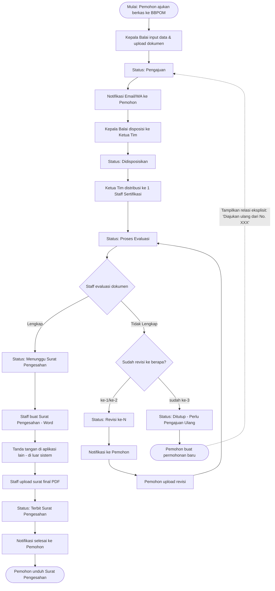
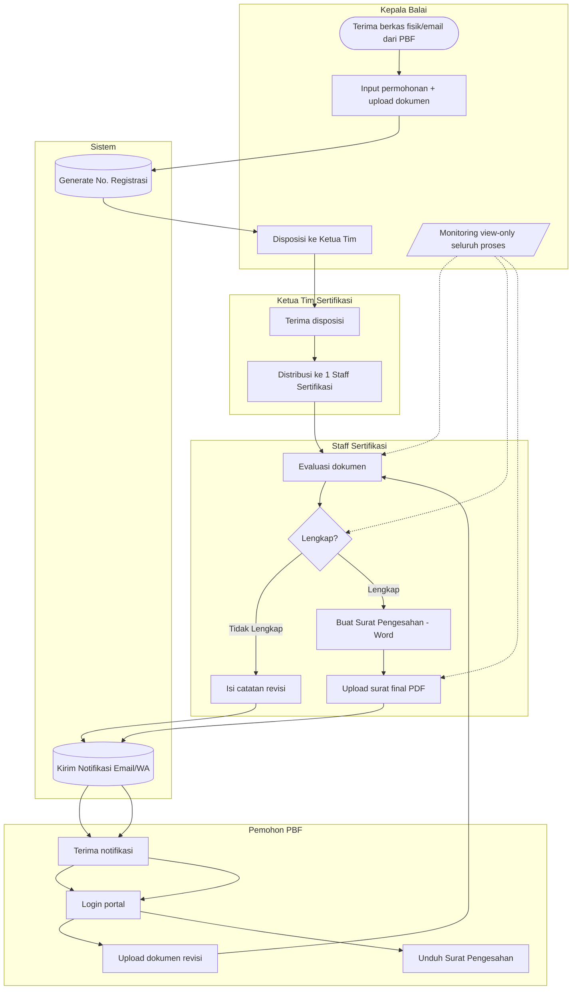
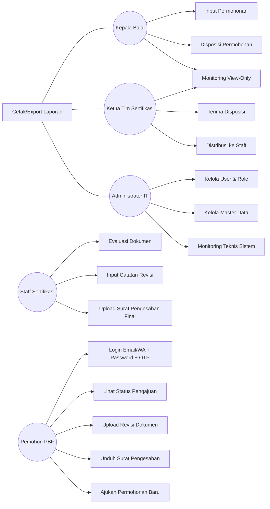
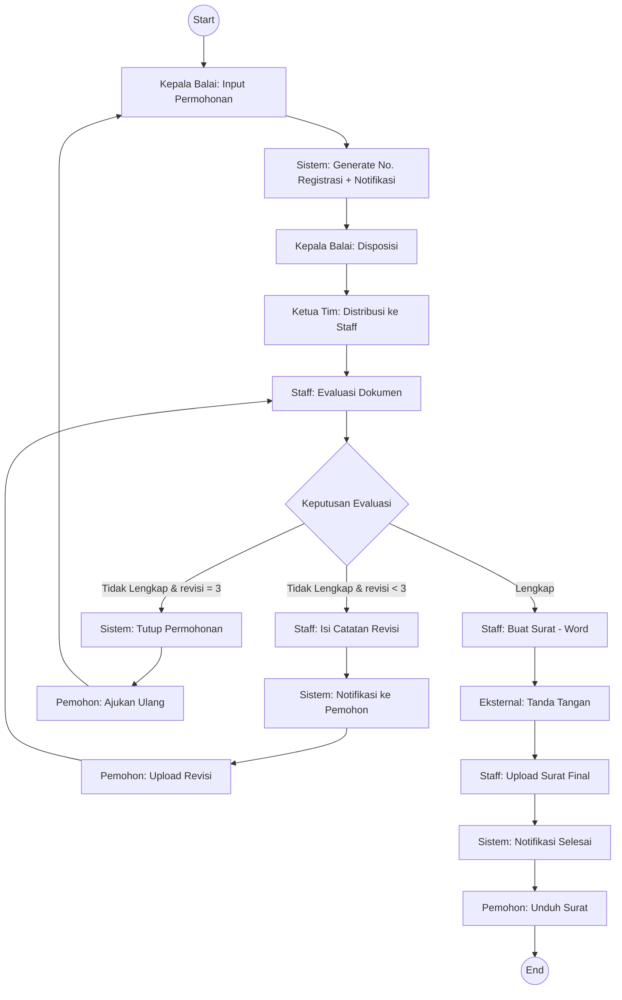
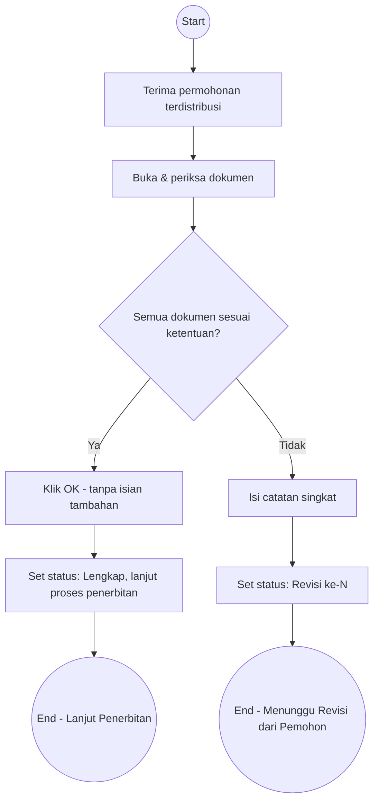
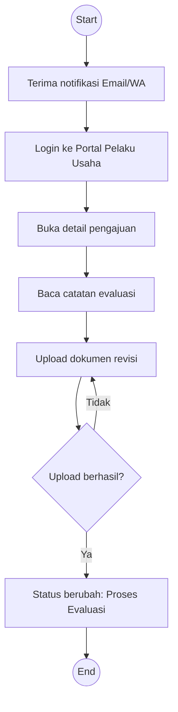

# TAHAP 2 — BUSINESS PROCESS
## Aplikasi Pengajuan Rancangan Denah Pedagang Besar Farmasi (PBF)

**Dokumen:** Business Process Design
**Versi:** 1.3 (Final — form evaluasi disederhanakan + notifikasi internal WA)
**Acuan:** Tahap 1 — Analisis Sistem (v1.2, disetujui)

> Catatan notasi: Diagram di bawah menggunakan format **Mermaid** (teks). Jika dibuka di editor yang mendukung Mermaid (VS Code + extension, GitHub, Notion, mermaid.live), diagram akan tampil visual otomatis. Jika tidak, blok kode tetap bisa dibaca sebagai alur logis.

---

## 1. Business Flow (Narasi Alur Bisnis)

### 1.1 Ringkasan Alur Utama

| # | Tahap | Aktor Pelaksana | SLA | Status Terkait |
|---|---|---|---|---|
| 1 | Input permohonan + upload dokumen | Kepala Balai (fungsi Sekretaris) | 1 hari kerja | **Pengajuan** |
| 2 | Disposisi ke Ketua Tim Sertifikasi | Kepala Balai | 1 hari kerja | **Didisposisikan** |
| 3 | Distribusi ke 1 Staff Sertifikasi | Ketua Tim Sertifikasi | (bagian dari SLA evaluasi) | **Proses Evaluasi** |
| 4 | Evaluasi dokumen | Staff Sertifikasi | 7 hari kerja | **Proses Evaluasi** |
| 5a | Jika Lengkap → lanjut penerbitan | Staff Sertifikasi | — | **Menunggu Surat Pengesahan** |
| 5b | Jika Tidak Lengkap → revisi | Staff Sertifikasi → Pemohon | maks. 3 siklus, **SLA clock-off** (tidak ada batas waktu, jam SLA berhenti berjalan) | **Revisi ke-1/2/3** |
| 6 | Pembuatan surat (manual Word) + TTD (aplikasi lain) + upload surat final | Staff Sertifikasi | **3 hari kerja atau lebih cepat** | **Menunggu Surat Pengesahan** |
| 7 | Notifikasi ke pemohon | Sistem (otomatis) | — | **Terbit Surat Pengesahan** (status akhir) |

### 1.2 Narasi Per Tahap

**1) Input Permohonan**
Kepala Balai (bertindak selaku fungsi Sekretaris) menginput data NIB, Nama PBF, No. WhatsApp, Email pemohon, serta mengunggah 5 dokumen wajib (Surat Permohonan, Surat Pernyataan, Rancangan/Perubahan Denah, Izin PBF, STRA Penanggung Jawab). Setelah disimpan, sistem membuat nomor registrasi otomatis, status berubah menjadi **Pengajuan**, dan notifikasi Email + WhatsApp otomatis terkirim ke pemohon. SLA tahap ini 1 hari kerja dihitung sejak dokumen diterima BBPOM (di luar sistem) sampai data berhasil diinput ke sistem.

**2) Disposisi**
Kepala Balai mendisposisikan permohonan ke Ketua Tim Sertifikasi (dengan catatan opsional). Status berubah menjadi **Didisposisikan**. SLA 1 hari kerja.

**3) Distribusi & Evaluasi**
Ketua Tim menunjuk **1 Staff Sertifikasi** untuk menangani permohonan (relasi one-to-one, dikonfirmasi di Tahap 1). Status menjadi **Proses Evaluasi**. Staff memiliki waktu 7 hari kerja untuk memeriksa kelengkapan & kesesuaian dokumen terhadap ketentuan denah PBF.

**4) Hasil Evaluasi**
- **Lengkap** → Staff cukup klik **"OK"** (tanpa isian tambahan) → status **Menunggu Surat Pengesahan**, lanjut ke proses penerbitan.
- **Tidak Lengkap** → Staff **cukup mengisi catatan** (tidak perlu narasi terpisah maupun upload dokumen evaluasi — disederhanakan dari draft awal). Status menjadi **Revisi ke-N** (N = 1, 2, atau 3). Notifikasi otomatis terkirim ke pemohon, **dan juga ke Staff & Ketua Tim terkait via WhatsApp** (lihat bagian Notifikasi di bawah). Pemohon login dan mengunggah dokumen revisi. Siklus ini berulang maksimal 3 kali. **Tidak ada batas waktu (SLA clock-off)** pada status Revisi — jam SLA berhenti berjalan selama menunggu pemohon mengunggah revisi, dan berjalan kembali begitu Staff mulai mengevaluasi ulang dokumen yang diunggah.

**5) Skenario Revisi ke-3 Gagal (hasil klarifikasi Tahap 1)**
Jika setelah revisi ke-3 dokumen **masih dinyatakan Tidak Lengkap**, permohonan ditutup dengan status **Ditutup – Perlu Pengajuan Ulang**. Pemohon diarahkan untuk membuat **permohonan baru** (nomor registrasi baru). Sistem menautkan permohonan baru ke permohonan lama sebagai riwayat, dan **relasi ini ditampilkan secara eksplisit kepada pemohon** (misal label "Pengajuan ulang dari No. Registrasi XXX" pada detail pengajuan baru).

**6) Penerbitan Surat Pengesahan**
Jika Lengkap (baik dari evaluasi awal maupun setelah revisi), Staff membuat Surat Pengesahan secara manual di Microsoft Word, lalu proses tanda tangan dilakukan di aplikasi lain (di luar sistem ini — *out-of-scope*, sesuai Tahap 1). Tahap ini memiliki SLA **3 hari kerja atau lebih cepat**. Setelah surat final ditandatangani, Staff mengunggahnya ke sistem (format PDF). Status langsung berubah menjadi **Terbit Surat Pengesahan** — ini adalah **status akhir** (final), aktif segera setelah Staff berhasil mengunggah surat, tidak menunggu aksi unduh dari pemohon.

**7) Monitoring oleh Kepala Balai**
Sepanjang proses, Kepala Balai memiliki akses **view-only** ke seluruh status, dokumen, dan catatan evaluasi — tanpa perlu melakukan approval tambahan (sesuai keputusan Tahap 1).

### 1.3 Notifikasi Per Tahap (Pemohon & Internal)

Sebelumnya notifikasi otomatis hanya ditujukan ke pemohon. **Ditambahkan: notifikasi WhatsApp juga dikirim ke pihak internal terkait** (Staff dan/atau Ketua Tim) di setiap tahap yang relevan, agar mereka tidak perlu terus-menerus mengecek dashboard secara manual.

| Perubahan Status | Notifikasi ke Pemohon | Notifikasi Internal via WA |
|---|---|---|
| Pengajuan (data disimpan) | ✅ Email + WA | — |
| Didisposisikan | — | ✅ **Ketua Tim** (permohonan baru masuk ke antrean disposisinya) |
| Proses Evaluasi (distribusi ke Staff) | — | ✅ **Staff** (permohonan baru didistribusikan kepadanya) |
| Revisi ke-1/2/3 (Tidak Lengkap) | ✅ Email + WA | ✅ **Ketua Tim** (sebagai info, permohonan di timnya butuh revisi) |
| Pemohon selesai upload revisi | — | ✅ **Staff** (dokumen revisi sudah siap dievaluasi ulang) |
| Menunggu Surat Pengesahan (Lengkap) | — | ✅ **Ketua Tim** (info bahwa permohonan di timnya siap diterbitkan) |
| Terbit Surat Pengesahan | ✅ Email + WA | ✅ **Ketua Tim** (info penutupan permohonan) |
| Ditutup – Perlu Pengajuan Ulang | ✅ Email + WA | ✅ **Ketua Tim** |
| Reassignment staff (M-17) | — | ✅ **Staff lama & Staff baru** |
| Reminder manual (M-17) | — | ✅ **Staff** yang bersangkutan (dipicu manual oleh Ketua Tim) |

> Catatan: Kepala Balai **tidak** termasuk penerima notifikasi WA rutin per tahap (konsisten dengan perannya yang view-only/monitoring, bukan eksekutor proses) — kecuali Anda ingin menambahkannya juga. Mohon dikonfirmasi bila Kepala Balai perlu turut menerima notifikasi tertentu.

---

## 2. Status Permohonan & Timeline (Revisi dari Usulan Tahap 1)

Berikut usulan final status, sudah memasukkan skenario "pengajuan ulang":

| No | Status | SLA / Target Waktu | Pemicu Perubahan Status |
|---|---|---|---|
| 1 | **Pengajuan** | 1 hari kerja (input) | Kepala Balai submit data & dokumen |
| 2 | **Didisposisikan** | 1 hari kerja | Kepala Balai disposisi ke Ketua Tim |
| 3 | **Proses Evaluasi** | 7 hari kerja | Ketua Tim distribusi ke Staff |
| 4 | **Revisi ke-1** | **Clock-off** (jam SLA berhenti, tidak ada batas waktu bagi pemohon) | Staff menyatakan Tidak Lengkap (evaluasi ke-1) |
| 5 | **Revisi ke-2** | Clock-off (idem) | Staff menyatakan Tidak Lengkap (evaluasi ke-2) |
| 6 | **Revisi ke-3** | Clock-off (idem) | Staff menyatakan Tidak Lengkap (evaluasi ke-3) |
| 7 | **Ditutup – Perlu Pengajuan Ulang** | — (status akhir) | Staff menyatakan Tidak Lengkap setelah revisi ke-3. Permohonan baru akan menampilkan relasi eksplisit "diajukan ulang dari No. XXX" |
| 8 | **Menunggu Surat Pengesahan** | **3 hari kerja atau lebih cepat** | Staff menyatakan Lengkap (kapan pun di evaluasi 1/2/3) |
| 9 | **Terbit Surat Pengesahan** | — (status akhir) | Staff upload surat final yang sudah ditandatangani — langsung final, tidak menunggu unduh pemohon |

> ✅ **Terkonfirmasi:** Status akhir bernama **"Terbit Surat Pengesahan"**, aktif segera setelah Staff mengunggah surat final (bukan status "Selesai" terpisah). Jam SLA pada status Revisi bersifat **clock-off** — pemohon tidak dibatasi waktu untuk mengunggah revisi, dan durasi menunggu revisi tidak dihitung sebagai keterlambatan SLA staff. Relasi permohonan lama–baru pada skenario pengajuan ulang **ditampilkan secara eksplisit** ke pemohon di halaman detail pengajuan.

---

## 3. Flowchart Utama (Mermaid)

---

## 4. BPMN Sederhana (Swimlane per Aktor)

> Catatan: Ini adalah representasi **BPMN sederhana** dalam bentuk swimlane berbasis Mermaid (bukan notasi BPMN 2.0 formal seperti pada Camunda/Bizagi). Jika Anda memerlukan file BPMN 2.0 standar (.bpmn) untuk keperluan dokumentasi formal instansi, beri tahu saya — bisa disiapkan terpisah di luar chat ini.

---

## 5. Use Case Diagram

Mermaid tidak memiliki notasi UML Use Case native, sehingga disajikan dalam **dua bentuk**: (a) diagram relasi aktor–use case, dan (b) tabel use case lengkap untuk referensi teknis.

### 5.1 Diagram Relasi Aktor – Use Case

### 5.2 Tabel Use Case Lengkap

| Kode | Use Case | Aktor Utama | Deskripsi Singkat |
|---|---|---|---|
| UC-01 | Input Permohonan | Kepala Balai | Input data pemohon + upload 5 dokumen wajib |
| UC-02 | Disposisi Permohonan | Kepala Balai | Meneruskan permohonan ke Ketua Tim |
| UC-03 | Monitoring View-Only | Kepala Balai, Ketua Tim | Melihat status & dokumen tanpa aksi approval |
| UC-04 | Distribusi ke Staff | Ketua Tim | Menunjuk 1 Staff untuk menangani permohonan |
| UC-05 | Evaluasi Dokumen | Staff Sertifikasi | Menilai Lengkap/Tidak Lengkap |
| UC-06 | Input Catatan Revisi | Staff Sertifikasi | Mengisi catatan (tanpa narasi/upload dokumen evaluasi — disederhanakan) |
| UC-07 | Buat & Upload Surat Pengesahan | Staff Sertifikasi | Upload PDF surat final yang sudah ditandatangani |
| UC-08 | Login Portal Pemohon | Pemohon | Login Email/No.WA + Password + OTP (pertama kali) |
| UC-09 | Lihat Status & Timeline | Pemohon | Tracking progres pengajuan |
| UC-10 | Upload Revisi | Pemohon | Unggah dokumen revisi (maks. 3x) |
| UC-11 | Unduh Surat Pengesahan | Pemohon | Download dokumen final |
| UC-12 | Ajukan Permohonan Baru | Pemohon | Setelah revisi ke-3 gagal, buat pengajuan baru |
| UC-13 | Kelola User & Role | Admin IT | CRUD user internal & hak akses |
| UC-14 | Kelola Master Data | Admin IT | Kelola data PBF, referensi, dsb. |
| UC-15 | Cetak & Export Laporan | Kepala Balai, Ketua Tim, Admin IT | Rekap pengajuan, statistik SLA, export Excel/PDF |
| UC-16 | Terima Notifikasi Otomatis | Pemohon (via Sistem) | Email & WhatsApp di setiap perubahan status |

---

## 6. Activity Diagram

### 6.1 Activity Diagram — Alur Utama (End-to-End)

### 6.2 Activity Diagram — Role: Staff Sertifikasi (Detail Evaluasi)

### 6.3 Activity Diagram — Role: Pemohon (Upload Revisi)

---

## 7. Poin Klarifikasi — Status

1. ✅ **Terjawab** — **Tidak ada batas waktu revisi**; SLA bersifat **clock-off** selama menunggu upload revisi dari pemohon.
2. ✅ **Terjawab (direvisi)** — SLA tahap "Menunggu Surat Pengesahan": **3 hari kerja atau lebih cepat**.
3. ✅ **Terjawab (direvisi)** — Status akhir bernama **"Terbit Surat Pengesahan"**, langsung aktif saat Staff selesai upload surat final (tidak ada status "Selesai" terpisah, dan tidak menunggu unduh pemohon).
4. ✅ **Terjawab** — Relasi permohonan lama→baru pada skenario pengajuan ulang **ditampilkan secara eksplisit** ke pemohon di halaman detail pengajuan.
5. ✅ **Terjawab (revisi baru)** — Form evaluasi disederhanakan: **Lengkap** cukup klik OK (tanpa isian tambahan); **Tidak Lengkap** cukup isi **catatan** saja (narasi terpisah dan upload dokumen evaluasi **dihilangkan**).
6. ✅ **Terjawab (revisi baru)** — Ditambahkan notifikasi **WhatsApp ke Staff & Ketua Tim** di berbagai tahap (lihat tabel di 1.3), tidak hanya ke pemohon.

Seluruh poin klarifikasi Tahap 2 telah terjawab dan sudah diintegrasikan ke dalam narasi, tabel status, serta diagram di atas.

---

**Status Dokumen:** Final untuk Tahap 2 (v1.3) — menunggu persetujuan akhir Anda untuk lanjut ke **Tahap 3 — Perancangan Sistem** (Daftar Modul, Struktur Menu, Hak Akses tiap Role, User Journey, Navigasi Aplikasi).
