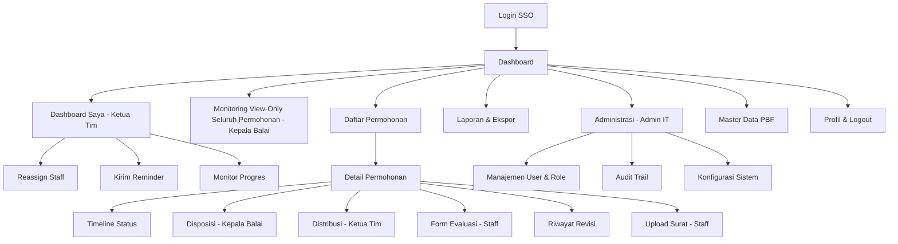
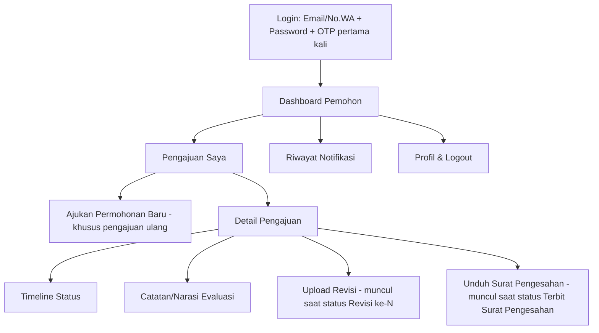

# TAHAP 3 — PERANCANGAN SISTEM
## Aplikasi Pengajuan Rancangan Denah Pedagang Besar Farmasi (PBF)

**Dokumen:** System Design Blueprint
**Versi:** 1.2 (Final — form evaluasi disederhanakan + notifikasi internal WA)
**Acuan:** Tahap 1 — Analisis Sistem (v1.2) & Tahap 2 — Business Process (v1.2), disetujui

---

## 1. Daftar Modul

Modul disusun berdasarkan kebutuhan fungsional (FR-01 s.d. FR-18) dari Tahap 1, dikelompokkan agar mencerminkan struktur pengembangan (development-ready).

| Kode Modul | Nama Modul | Deskripsi | Portal | Terkait FR |
|---|---|---|---|---|
| M-01 | **Autentikasi & Akses** | Login SSO (internal), Login Email/No.WA + Password + OTP (pemohon), manajemen sesi | Keduanya | FR-11, FR-12 |
| M-02 | **Manajemen Permohonan** | Input permohonan (Kepala Balai — pengajuan pertama), **pengajuan ulang mandiri oleh Pemohon via portal** (khusus skenario pasca revisi ke-3 gagal, tanpa melalui Kepala Balai), generate no. registrasi, riwayat relasi lama↔baru | Keduanya | FR-01, FR-02, FR-16 |
| M-03 | **Disposisi & Distribusi** | Disposisi Kepala Balai → Ketua Tim, distribusi Ketua Tim → Staff (1:1) | Internal | FR-03, FR-04 |
| M-04 | **Evaluasi Dokumen** | Form evaluasi disederhanakan: **Lengkap** = klik OK; **Tidak Lengkap** = isi catatan saja (tanpa narasi terpisah/upload dokumen evaluasi), kontrol maks. 3 revisi | Internal | FR-05 |
| M-05 | **Revisi Dokumen (Pemohon)** | Upload dokumen revisi oleh pemohon, riwayat revisi per siklus | Pelaku Usaha | FR-05, FR-07 |
| M-06 | **Penerbitan Surat Pengesahan** | Upload surat final (PDF) yang sudah ditandatangani, perubahan status final | Internal | FR-08 |
| M-07 | **Tracking Status & Timeline** | Timeline status berjalan (9 status), durasi tiap tahap (termasuk logika clock-off saat revisi) | Keduanya | FR-09 |
| M-08 | **Dashboard Monitoring SLA** | Dashboard keterlambatan **berskala per role** — Kepala Balai (semua permohonan, view-only, lihat M-15), Ketua Tim (dashboard sendiri, khusus permohonan yang berada di bawah timnya), Staff (permohonan miliknya) | Internal | FR-10 |
| M-09 | **Notifikasi Otomatis** | Trigger Email & WhatsApp Gateway di setiap perubahan status — ke Pemohon **dan juga ke Staff/Ketua Tim terkait** (lihat detail per tahap di Tahap 2 §1.3), log pengiriman & retry | Keduanya (server-side) | FR-06 |
| M-10 | **Manajemen User & Role** | CRUD user internal, mapping role, reset akses | Internal | FR-13 |
| M-11 | **Audit Trail / Log Aktivitas** | Pencatatan siapa-apa-kapan di seluruh modul | Internal | FR-14 |
| M-12 | **Unduh Dokumen** | Unduh Surat Pengesahan final oleh pemohon | Pelaku Usaha | FR-15 |
| M-13 | **Master Data PBF** | Data NIB, nama PBF, kontak — reuse otomatis saat pengajuan baru/ulang | Internal | FR-16 |
| M-14 | **Laporan & Ekspor Data** | Rekap pengajuan per periode/status/SLA, export Excel/PDF, cetak | Internal | FR-17 |
| M-15 | **Monitoring View-Only (Kepala Balai)** | Tampilan read-only seluruh progres & dokumen tanpa aksi approval | Internal | FR-18 |
| M-16 | **Konfigurasi Sistem** | Pengaturan SLA per tahap, kalender hari libur, template notifikasi, integrasi (SSO, WA Gateway) | Internal (Admin IT) | Pendukung NFR |
| M-17 | **Eskalasi & Reassignment (Ketua Tim)** | Reassign permohonan ke Staff lain, kirim reminder ke Staff, monitor progres per permohonan/staff, dan aksi optimasi proses lainnya | Internal (khusus Ketua Tim) | Baru — hasil klarifikasi Tahap 3 |

> Total **17 modul**. M-16 (Konfigurasi Sistem) ditambahkan sebagai modul pendukung teknis (bukan dari FR eksplisit) agar SLA, hari libur, dan template notifikasi dapat dikelola tanpa perlu ubah kode — penting mengingat SLA sudah beberapa kali direvisi selama diskusi kita (1 hari, 7 hari, 3 hari, clock-off, dst). M-17 ditambahkan berdasarkan klarifikasi Anda bahwa Ketua Tim memerlukan kemampuan reassign staff, reminder, dan monitoring progres sebagai bagian dari perannya — cakupan detail aksi "hal lain untuk mengoptimalkan proses" akan diperjelas lebih lanjut jika muncul kebutuhan spesifik selama development.

---

## 2. Struktur Menu

### 2.1 Portal Internal BBPOM

```
├── Dashboard
│   ├── Ringkasan Status Pengajuan (semua role)
│   ├── Monitoring SLA — Seluruh Permohonan, View-Only (M-15) — khusus Kepala Balai
│   ├── Dashboard Saya — Permohonan di Bawah Tim Saya (M-08) — khusus Ketua Tim
│   │   ├── Reassign Staff (M-17)
│   │   ├── Kirim Reminder ke Staff (M-17)
│   │   └── Monitor Progres per Permohonan/Staff (M-17)
│   └── Dashboard Saya — Permohonan Ditangani (M-08) — khusus Staff
│
├── Permohonan
│   ├── Input Permohonan Baru (M-02) — khusus Kepala Balai
│   ├── Daftar Permohonan (M-02, M-07)
│   │   └── Detail Permohonan
│   │       ├── Data Pemohon & Dokumen
│   │       ├── Timeline Status (M-07)
│   │       ├── Disposisi (M-03) — khusus Kepala Balai
│   │       ├── Distribusi ke Staff (M-03) — khusus Ketua Tim
│   │       ├── Form Evaluasi (M-04) — khusus Staff
│   │       ├── Riwayat Revisi (M-05)
│   │       └── Upload Surat Pengesahan (M-06) — khusus Staff
│   └── Riwayat Pengajuan Ulang (relasi lama↔baru, diajukan mandiri oleh Pemohon) (M-02)
│
├── Laporan
│   └── Rekap & Ekspor (M-14) — Kepala Balai, Ketua Tim, Admin IT
│
├── Master Data
│   └── Data PBF (M-13) — Admin IT (kelola), lainnya (lihat)
│
├── Administrasi (khusus Admin IT)
│   ├── Manajemen User & Role (M-10)
│   ├── Audit Trail (M-11)
│   └── Konfigurasi Sistem (M-16)
│       ├── Pengaturan SLA per Tahap
│       ├── Kalender Hari Libur
│       ├── Template Notifikasi
│       └── Integrasi (SSO, WA Gateway)
│
└── Profil & Logout
```

### 2.2 Portal Pelaku Usaha (Pemohon)

```
├── Dashboard Pemohon
│   └── Ringkasan Status Pengajuan Aktif
│
├── Pengajuan Saya
│   ├── Ajukan Permohonan Baru (M-02) — hanya aktif untuk pengajuan ulang (setelah status "Ditutup – Perlu Pengajuan Ulang"), dilakukan mandiri oleh Pemohon tanpa melalui Kepala Balai
│   └── Daftar Riwayat Pengajuan (termasuk pengajuan ulang, dengan label relasi "Diajukan ulang dari No. XXX")
│       └── Detail Pengajuan
│           ├── Timeline Status (M-07)
│           ├── Catatan/Narasi Evaluasi (baca)
│           ├── Upload Revisi (M-05) — muncul saat status Revisi ke-N
│           └── Unduh Surat Pengesahan (M-12) — muncul saat status Terbit Surat Pengesahan
│
├── Notifikasi
│   └── Riwayat Notifikasi Email/WA (M-09)
│
└── Profil & Logout
    └── (Login: Email/No.WA + Password, OTP saat pertama kali login; kredensial awal dikirim otomatis via WA/Email saat pengajuan pertama diinput Kepala Balai)
```

---

## 3. Hak Akses Tiap Role

### 3.1 Matriks Modul vs Role (Portal Internal)

Legenda: **F** = Full (create/edit/delete), **E** = Eksekusi aksi bisnis spesifik, **V** = View only, **–** = Tidak ada akses

| Modul | Kepala Balai | Ketua Tim Sertifikasi | Staff Sertifikasi | Administrator IT |
|---|---|---|---|---|
| M-01 Autentikasi & Akses | V (profil sendiri) | V | V | F (kelola akses org lain) |
| M-02 Manajemen Permohonan | **F** (input pengajuan pertama) | V | V | V |
| M-03 Disposisi & Distribusi | **E** (disposisi) | **E** (distribusi) | – | V |
| M-04 Evaluasi Dokumen | V | V | **F** | V |
| M-05 Revisi Dokumen (baca sisi internal) | V | V | V (baca hasil upload pemohon) | V |
| M-06 Penerbitan Surat Pengesahan | V | V | **E** (upload) | V |
| M-07 Tracking Status & Timeline | V | V | V | V |
| M-08 Dashboard Monitoring SLA | – (lihat M-15) | **V** (dashboard sendiri, khusus timnya) | V (permohonan miliknya) | V (teknis) |
| M-09 Notifikasi Otomatis | V (log) | V (log) | V (log) | F (kelola template & gateway) |
| M-10 Manajemen User & Role | – | – | – | **F** |
| M-11 Audit Trail | V | V | – | **F** |
| M-12 Unduh Dokumen (sisi internal, jika diperlukan) | V | V | V | V |
| M-13 Master Data PBF | V | V | V | **F** |
| M-14 Laporan & Ekspor Data | **F** (cetak/export) | **F** (cetak/export) | – | **F** (cetak/export) |
| M-15 Monitoring View-Only (Seluruh Permohonan) | **F** (khusus role ini) | – | – | – |
| M-16 Konfigurasi Sistem | – | – | – | **F** |
| M-17 Eskalasi & Reassignment | – | **F** (reassign, reminder, monitor progres) | – | – |

> ✅ **Terkonfirmasi:** Ketua Tim **tidak** memiliki akses ke M-15 (monitoring view-only seluruh permohonan seperti Kepala Balai). Ketua Tim memiliki **dashboard sendiri (M-08)** yang lingkupnya terbatas pada permohonan di bawah timnya, dilengkapi kemampuan aksi (M-17): reassign Staff, kirim reminder, dan monitoring progres — sebagai alat eskalasi/optimasi proses, bukan sekadar tampilan pasif.

### 3.2 Portal Pelaku Usaha

| Modul | Pemohon (PBF) |
|---|---|
| M-01 Autentikasi & Akses | F (akun sendiri) |
| M-02 Manajemen Permohonan | **F** — khusus untuk **pengajuan ulang** (mengisi form + upload dokumen mandiri di portal, tanpa melalui Kepala Balai); pengajuan **pertama** tetap diinput oleh Kepala Balai |
| M-05 Revisi Dokumen | F (upload revisi, maks. 3x per siklus) |
| M-07 Tracking Status & Timeline | V |
| M-09 Notifikasi Otomatis | V (riwayat notifikasi miliknya) |
| M-12 Unduh Dokumen | E (unduh surat final) |

---

## 4. User Journey Tiap Role

### 4.1 Kepala Balai

1. Login via **SSO BPOM** → masuk Dashboard.
2. Menerima berkas fisik/email dari PBF (di luar sistem) → klik **"Input Permohonan Baru"**.
3. Mengisi data (NIB, Nama PBF, No. WA, Email) + upload 5 dokumen wajib → Simpan → sistem generate No. Registrasi, status **Pengajuan**.
4. Membuka detail permohonan → klik **"Disposisi"** → pilih Ketua Tim Sertifikasi (+ catatan opsional) → status **Didisposisikan**.
5. Sewaktu-waktu, membuka **Dashboard Monitoring (view-only)** untuk memantau progres seluruh permohonan tanpa perlu melakukan aksi approval apa pun.
6. Membuka **Laporan** untuk cetak/export rekap pengajuan sesuai kebutuhan.

### 4.2 Ketua Tim Sertifikasi

1. Login via SSO → menerima notifikasi WA saat ada permohonan baru yang didisposisikan kepadanya.
2. Membuka detail permohonan → klik **"Distribusikan"** → pilih 1 Staff Sertifikasi → status **Proses Evaluasi**.
3. Membuka **Dashboard Saya** (M-08, khusus permohonan di bawah timnya) untuk memantau permohonan yang mendekati/melewati SLA (evaluasi 7 hari kerja).
4. Jika ada permohonan berisiko terlambat atau macet, menggunakan menu **Eskalasi & Reassignment (M-17)**:
   - **Reassign** permohonan ke Staff Sertifikasi lain.
   - **Kirim reminder** ke Staff yang menangani.
   - **Monitor progres** detail per permohonan/per staff.
   - Kemungkinan aksi tambahan lain untuk optimasi proses akan diperjelas lebih lanjut sesuai kebutuhan operasional saat development/UAT.
5. Membuka Laporan untuk export data bila diperlukan.

### 4.3 Staff Sertifikasi

1. Login via SSO → melihat daftar permohonan yang didistribusikan kepadanya (menerima notifikasi WA saat baru didistribusikan).
2. Membuka detail permohonan → memeriksa dokumen.
3. Mengisi form evaluasi:
   - Jika **Lengkap** → klik **OK** (tanpa isian tambahan) → submit → status **Menunggu Surat Pengesahan**.
   - Jika **Tidak Lengkap** → isi **catatan saja** (tanpa narasi terpisah, tanpa upload dokumen evaluasi) → submit → status **Revisi ke-N**, sistem otomatis kirim notifikasi Email+WA ke pemohon, dan WA ke Ketua Tim sebagai info.
4. Menunggu pemohon upload revisi (clock-off, tidak ada batas waktu) → saat pemohon upload, status kembali **Proses Evaluasi** → staff evaluasi ulang (poin 3 berulang, maks. 3 kali).
5. Jika revisi ke-3 tetap Tidak Lengkap → sistem otomatis set status **Ditutup – Perlu Pengajuan Ulang** (Staff cukup submit hasil evaluasi terakhir, sistem yang menutup).
6. Jika Lengkap → membuat Surat Pengesahan di Microsoft Word (di luar sistem) → proses TTD di aplikasi lain (di luar sistem) → kembali ke sistem, upload surat final (PDF) pada tahap **Menunggu Surat Pengesahan** (target 3 hari kerja) → submit → status **Terbit Surat Pengesahan** (final), notifikasi otomatis terkirim ke pemohon.

### 4.4 Administrator IT

1. Login via SSO → masuk ke menu **Administrasi**.
2. Mengelola user & role (tambah/nonaktifkan pegawai, atur role: Kepala Balai/Ketua Tim/Staff/Admin IT).
3. Mengelola master data PBF (jika ada koreksi data NIB/nama yang perlu diperbaiki).
4. Membuka **Konfigurasi Sistem**: mengatur nilai SLA per tahap (mis. 1/7/3 hari kerja), kalender hari libur, template notifikasi Email/WA, kredensial integrasi (SSO, WA Gateway).
5. Meninjau **Audit Trail** bila ada kebutuhan investigasi/pelaporan.
6. Tidak terlibat dalam alur bisnis sertifikasi (tidak bisa disposisi/evaluasi/upload surat).

### 4.5 Pemohon (PBF)

1. Menerima notifikasi Email/WhatsApp bahwa permohonannya telah diinput (status **Pengajuan**).
2. Bersamaan dengan notifikasi pertama, sistem otomatis mengirimkan **kredensial login (password awal)** ke pemohon via WhatsApp atau Email.
3. Login menggunakan Email/No. WA + Password → memasukkan **OTP** (hanya diminta saat pertama kali login) → masuk Dashboard Pemohon.
4. Melihat status pengajuan & timeline secara real-time.
5. Jika status berubah menjadi **Revisi ke-N**: menerima notifikasi → login → membuka detail pengajuan → membaca **catatan** evaluasi → mengunggah dokumen revisi (tidak ada batas waktu).
6. Jika setelah revisi ke-3 masih Tidak Lengkap: menerima notifikasi bahwa permohonan **Ditutup – Perlu Pengajuan Ulang** → login ke portal → klik **"Ajukan Permohonan Baru"** → mengisi data & upload dokumen **secara mandiri** (tanpa melalui Kepala Balai) → sistem otomatis menautkan & menampilkan relasi **"Diajukan ulang dari No. XXX"** pada permohonan baru.
7. Jika status **Terbit Surat Pengesahan**: menerima notifikasi → login → mengunduh Surat Pengesahan.

---

## 5. Navigasi Aplikasi

### 5.1 Diagram Navigasi — Portal Internal BBPOM



### 5.2 Diagram Navigasi — Portal Pelaku Usaha



---

## 6. Poin Klarifikasi — Status

1. ✅ **Terjawab** — Ketua Tim **tidak** mendapat akses M-15 seperti Kepala Balai; ia memiliki **dashboard sendiri (M-08)** yang lingkupnya terbatas pada permohonan di bawah timnya.
2. ✅ **Terjawab** — Pengajuan ulang **tidak** melalui Kepala Balai; pemohon mengajukan **mandiri** via portal (M-02, khusus skenario ini).
3. ✅ **Terjawab** — Kredensial (password) awal pemohon **dikirim otomatis dari aplikasi via WhatsApp atau Email**.
4. ✅ **Terjawab** — Ketua Tim memiliki kemampuan **reassign Staff**, **kirim reminder**, **monitor progres**, dan kemungkinan **aksi lain untuk optimasi proses** (dicakup dalam modul baru M-17, detail spesifik dapat diperkaya di tahap berikutnya sesuai kebutuhan operasional).
5. ✅ **Terjawab (revisi baru)** — M-04 disederhanakan: Lengkap = klik OK; Tidak Lengkap = isi catatan saja.
6. ✅ **Terjawab (revisi baru)** — M-09 diperluas: notifikasi WA kini juga menjangkau Staff & Ketua Tim di berbagai tahap, tidak hanya Pemohon.

Seluruh poin klarifikasi Tahap 3 telah terjawab dan diintegrasikan ke dalam daftar modul, struktur menu, hak akses, user journey, dan navigasi di atas.

---

**Status Dokumen:** Final untuk Tahap 3 (v1.2) — menunggu persetujuan akhir Anda untuk lanjut ke **Tahap 4 — Perancangan Database** (ERD, Relasi Tabel, Struktur Database, Data Dictionary).
