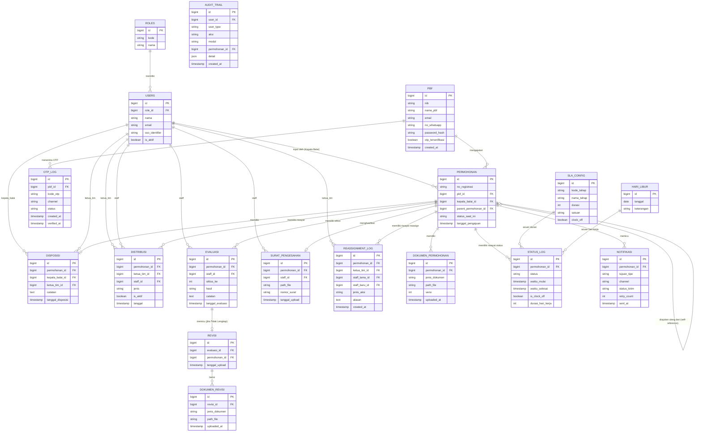

# TAHAP 4 — PERANCANGAN DATABASE
## Aplikasi Pengajuan Rancangan Denah Pedagang Besar Farmasi (PBF)

**Dokumen:** Database Design Blueprint
**Versi:** 1.1 (Direvisi — evaluasi disederhanakan, notifikasi internal Staff/Ketua Tim ditegaskan)
**Acuan:** Tahap 1 (v1.2), Tahap 2 (v1.2), Tahap 3 (v1.1) — seluruhnya disetujui
**Database Engine:** MySQL (sesuai spesifikasi teknologi)

---

## 0. Prinsip Perancangan

1. Setiap tabel menggunakan `id` (BIGINT UNSIGNED, auto increment) sebagai primary key, kecuali dinyatakan lain.
2. Seluruh tabel transaksional memiliki `created_at`, `updated_at` (standar Laravel timestamps); tabel log tambahan `deleted_at` bila perlu soft-delete (khusus tabel non-audit).
3. Riwayat/histori **tidak menimpa (overwrite)** data lama — setiap revisi dokumen, disposisi ulang, atau reassignment dicatat sebagai **baris baru**, bukan update, demi kebutuhan **Audit Trail (M-11)**.
4. Relasi **permohonan lama ↔ permohonan baru** (skenario pengajuan ulang, Tahap 2 & 3) diimplementasikan sebagai **self-referencing foreign key** di tabel `permohonan`.
5. Logika **SLA clock-off** saat status Revisi (Tahap 2) direpresentasikan lewat tabel `status_log` dengan flag `is_clock_off`, sehingga dashboard SLA (M-08/M-15) dapat mengecualikan durasi tersebut dari perhitungan keterlambatan.
6. Nilai SLA per tahap **tidak di-hardcode**, melainkan disimpan di tabel `sla_config` (mendukung M-16 — Konfigurasi Sistem), karena selama diskusi kita angka SLA berubah beberapa kali (1/7/3 hari, dsb.) dan berpotensi berubah lagi di masa depan.

---

## 1. ERD (Entity Relationship Diagram)

> Catatan: `AUDIT_TRAIL` tidak digambar relasinya secara penuh di atas (agar diagram tidak terlalu padat) — tabel ini merujuk ke `USERS`/`PBF` (siapa) dan opsional ke `PERMOHONAN` (permohonan mana), mencatat aktivitas dari **seluruh modul** M-01 s.d. M-17.

---

## 2. Relasi Tabel (Penjelasan Kardinalitas)

| Relasi | Kardinalitas | Penjelasan |
|---|---|---|
| `roles` → `users` | 1 : N | Satu role dimiliki banyak user (Kepala Balai, Ketua Tim, Staff, Admin IT) |
| `pbf` → `permohonan` | 1 : N | Satu PBF (by NIB) dapat mengajukan banyak permohonan dari waktu ke waktu (A-10, Tahap 1) |
| `users (Kepala Balai)` → `permohonan` | 1 : N | Kepala Balai menginput banyak permohonan (pengajuan pertama) |
| `permohonan` → `permohonan` (self) | 1 : 0..1 | `parent_permohonan_id` menandai permohonan baru sebagai hasil pengajuan ulang dari permohonan lama (ditampilkan eksplisit ke pemohon sesuai Tahap 2/3) |
| `permohonan` → `dokumen_permohonan` | 1 : N | Menyimpan 5 jenis dokumen wajib; `versi` bertambah bila dokumen diunggah ulang di luar siklus revisi resmi |
| `permohonan` → `disposisi` | 1 : 0..1 | Satu permohonan hanya didisposisikan sekali ke satu Ketua Tim (Asumsi A-01, Tahap 1) |
| `permohonan` → `distribusi` | 1 : N | Riwayat distribusi — normalnya 1 baris (distribusi awal), bertambah bila terjadi **reassignment** (M-17); hanya 1 baris `is_aktif = true` pada satu waktu |
| `permohonan` → `evaluasi` | 1 : N (maks. 4 baris: evaluasi awal + hingga 3 kali re-evaluasi setelah revisi) | `siklus_ke` menandai urutan (0 = evaluasi awal, 1-3 = setelah revisi ke-N) |
| `evaluasi` → `revisi` | 1 : 0..1 | Hanya evaluasi dengan hasil "Tidak Lengkap" yang memicu siklus revisi |
| `revisi` → `dokumen_revisi` | 1 : N | Dokumen yang diunggah ulang oleh pemohon per siklus revisi |
| `permohonan` → `surat_pengesahan` | 1 : 0..1 | Satu permohonan menghasilkan maksimal satu surat final (jika permohonan berhasil) |
| `permohonan` → `status_log` | 1 : N | Baris baru setiap kali status berubah (9 status di Tahap 2); dipakai untuk timeline & perhitungan SLA |
| `permohonan` → `notifikasi` | 1 : N | Setiap perubahan status memicu 1+ baris notifikasi (Email dan/atau WA) |
| `permohonan` → `reassignment_log` | 1 : N | Riwayat aksi Ketua Tim melalui M-17 (reassign staff dan/atau reminder) |
| `pbf` → `otp_log` | 1 : N | Riwayat OTP yang dikirim (untuk verifikasi login pertama kali, sesuai Tahap 1/3) |
| `sla_config` | referensi (bukan FK langsung) | Dipakai oleh proses backend untuk menghitung target SLA per `kode_tahap`, dibandingkan dengan `status_log` |
| `hari_libur` | referensi | Dipakai untuk perhitungan "hari kerja" pada seluruh SLA (evaluasi 7 hari, disposisi 1 hari, penerbitan 3 hari, dsb.) |
| `audit_trail` | referensi ke `users`/`pbf`/`permohonan` | Mencatat seluruh aktivitas lintas modul untuk kebutuhan M-11 |

---

## 3. Struktur Database (Daftar Tabel & Kolom)

### 3.1 `roles`
| Kolom | Tipe | Keterangan |
|---|---|---|
| id | BIGINT UNSIGNED PK | |
| kode | VARCHAR(30) UNIQUE | `kepala_balai`, `ketua_tim`, `staff_sertifikasi`, `admin_it` |
| nama | VARCHAR(100) | Nama tampilan role |
| created_at, updated_at | TIMESTAMP | |

### 3.2 `users` (Internal BBPOM)
| Kolom | Tipe | Keterangan |
|---|---|---|
| id | BIGINT UNSIGNED PK | |
| role_id | BIGINT UNSIGNED FK → roles.id | |
| nama | VARCHAR(150) | |
| email | VARCHAR(150) UNIQUE | |
| sso_identifier | VARCHAR(150) NULLABLE | ID/username dari sistem SSO BPOM |
| is_aktif | BOOLEAN DEFAULT true | Nonaktifkan tanpa hapus data (dikelola Admin IT via M-10) |
| created_at, updated_at | TIMESTAMP | |

### 3.3 `pbf` (Master Data + Akun Login Pemohon)
| Kolom | Tipe | Keterangan |
|---|---|---|
| id | BIGINT UNSIGNED PK | |
| nib | VARCHAR(30) UNIQUE | |
| nama_pbf | VARCHAR(200) | |
| email | VARCHAR(150) | Dipakai untuk login & notifikasi |
| no_whatsapp | VARCHAR(20) | Dipakai untuk login & notifikasi |
| password_hash | VARCHAR(255) | Hash password (dikirim otomatis via WA/Email saat pengajuan pertama, sesuai Tahap 3) |
| otp_terverifikasi | BOOLEAN DEFAULT false | Menandai OTP sudah diverifikasi sekali (login berikutnya tidak perlu OTP lagi, sesuai Tahap 1/3) |
| created_at, updated_at | TIMESTAMP | |

> **Asumsi desain (mohon dikonfirmasi):** Satu NIB direpresentasikan sebagai **satu akun login** (kontak Email/WA utama). Jika satu PBF memiliki beberapa kontak/PIC yang perlu login terpisah, struktur ini perlu diubah menjadi tabel `pbf` (murni master data) + tabel `pemohon_akun` terpisah (1 PBF : N akun). Silakan koreksi jika demikian.

### 3.4 `permohonan`
| Kolom | Tipe | Keterangan |
|---|---|---|
| id | BIGINT UNSIGNED PK | |
| no_registrasi | VARCHAR(50) UNIQUE | Format disepakati mis. `PBF/DENAH/2026/00001` |
| pbf_id | BIGINT UNSIGNED FK → pbf.id | |
| kepala_balai_id | BIGINT UNSIGNED FK → users.id, NULLABLE | NULL jika permohonan adalah pengajuan ulang mandiri oleh pemohon |
| parent_permohonan_id | BIGINT UNSIGNED FK → permohonan.id, NULLABLE | Diisi jika ini hasil pengajuan ulang |
| dibuat_oleh_tipe | ENUM('kepala_balai','pemohon') | Menandai siapa yang membuat baris ini — Kepala Balai (pengajuan pertama) atau Pemohon (pengajuan ulang mandiri, sesuai Tahap 3) |
| status_saat_ini | VARCHAR(50) | Salah satu dari 9 status baku (denormalisasi dari `status_log` demi performa query list) |
| tanggal_pengajuan | TIMESTAMP | |
| created_at, updated_at | TIMESTAMP | |

### 3.5 `dokumen_permohonan`
| Kolom | Tipe | Keterangan |
|---|---|---|
| id | BIGINT UNSIGNED PK | |
| permohonan_id | BIGINT UNSIGNED FK | |
| jenis_dokumen | ENUM('surat_permohonan','surat_pernyataan','rancangan_denah','izin_pbf','stra_pj') | 5 dokumen wajib (Tahap 1) |
| path_file | VARCHAR(255) | |
| nama_file_asli | VARCHAR(255) | |
| versi | INT DEFAULT 1 | |
| uploaded_at | TIMESTAMP | |

### 3.6 `disposisi`
| Kolom | Tipe | Keterangan |
|---|---|---|
| id | BIGINT UNSIGNED PK | |
| permohonan_id | BIGINT UNSIGNED FK UNIQUE | Unique → 1 permohonan hanya 1 disposisi (Asumsi A-01) |
| kepala_balai_id | BIGINT UNSIGNED FK → users.id | |
| ketua_tim_id | BIGINT UNSIGNED FK → users.id | |
| catatan | TEXT NULLABLE | |
| tanggal_disposisi | TIMESTAMP | |

### 3.7 `distribusi`
| Kolom | Tipe | Keterangan |
|---|---|---|
| id | BIGINT UNSIGNED PK | |
| permohonan_id | BIGINT UNSIGNED FK | |
| ketua_tim_id | BIGINT UNSIGNED FK → users.id | |
| staff_id | BIGINT UNSIGNED FK → users.id | |
| jenis | ENUM('distribusi_awal','reassignment') | |
| is_aktif | BOOLEAN DEFAULT true | Hanya 1 baris aktif per permohonan pada satu waktu |
| tanggal | TIMESTAMP | |

### 3.8 `evaluasi`
| Kolom | Tipe | Keterangan |
|---|---|---|
| id | BIGINT UNSIGNED PK | |
| permohonan_id | BIGINT UNSIGNED FK | |
| staff_id | BIGINT UNSIGNED FK → users.id | |
| siklus_ke | TINYINT | 0 = evaluasi awal, 1–3 = evaluasi setelah revisi ke-N |
| hasil | ENUM('lengkap','tidak_lengkap') | |
| catatan | TEXT NULLABLE | Cukup satu field catatan (form evaluasi disederhanakan — tanpa narasi terpisah/upload dokumen evaluasi) |
| tanggal_evaluasi | TIMESTAMP | |

### 3.9 `revisi`
| Kolom | Tipe | Keterangan |
|---|---|---|
| id | BIGINT UNSIGNED PK | |
| evaluasi_id | BIGINT UNSIGNED FK UNIQUE | Evaluasi dengan hasil Tidak Lengkap yang memicu revisi ini |
| permohonan_id | BIGINT UNSIGNED FK | Denormalisasi untuk query cepat |
| tanggal_upload | TIMESTAMP | |

### 3.10 `dokumen_revisi`
| Kolom | Tipe | Keterangan |
|---|---|---|
| id | BIGINT UNSIGNED PK | |
| revisi_id | BIGINT UNSIGNED FK | |
| jenis_dokumen | VARCHAR(50) NULLABLE | Mengacu ke jenis dokumen wajib mana yang direvisi (opsional, jika pemohon perlu menandai) |
| path_file | VARCHAR(255) | |
| nama_file_asli | VARCHAR(255) | |
| uploaded_at | TIMESTAMP | |

### 3.11 `surat_pengesahan`
| Kolom | Tipe | Keterangan |
|---|---|---|
| id | BIGINT UNSIGNED PK | |
| permohonan_id | BIGINT UNSIGNED FK UNIQUE | |
| staff_id | BIGINT UNSIGNED FK → users.id | |
| path_file | VARCHAR(255) | File PDF hasil TTD (diupload dari luar sistem) |
| nomor_surat | VARCHAR(100) NULLABLE | Nomor surat resmi jika ada |
| tanggal_upload | TIMESTAMP | Memicu status **Terbit Surat Pengesahan** (status akhir, Tahap 2 v1.2) |

### 3.12 `status_log`
| Kolom | Tipe | Keterangan |
|---|---|---|
| id | BIGINT UNSIGNED PK | |
| permohonan_id | BIGINT UNSIGNED FK | |
| status | VARCHAR(50) | Salah satu dari 9 status baku |
| waktu_mulai | TIMESTAMP | |
| waktu_selesai | TIMESTAMP NULLABLE | NULL jika status masih berjalan |
| is_clock_off | BOOLEAN DEFAULT false | TRUE khusus status Revisi ke-1/2/3 (SLA tidak dihitung, sesuai Tahap 2) |
| durasi_hari_kerja | INT NULLABLE | Dihitung backend saat `waktu_selesai` terisi, mengacu ke `sla_config` & `hari_libur` |

### 3.13 `notifikasi`
| Kolom | Tipe | Keterangan |
|---|---|---|
| id | BIGINT UNSIGNED PK | |
| permohonan_id | BIGINT UNSIGNED FK NULLABLE | NULL jika notifikasi bersifat umum/sistem |
| tujuan_tipe | ENUM('pemohon','staff','ketua_tim','kepala_balai') | |
| tujuan_id | BIGINT UNSIGNED | Merujuk ke `pbf.id` atau `users.id` tergantung `tujuan_tipe` |
| channel | ENUM('email','whatsapp') | |
| template_kode | VARCHAR(50) | Merujuk ke template di M-16 |
| status_kirim | ENUM('terkirim','gagal','pending') | |
| retry_count | TINYINT DEFAULT 0 | |
| sent_at | TIMESTAMP NULLABLE | |
| error_message | TEXT NULLABLE | |

> ✅ **Catatan (revisi):** Kolom `tujuan_tipe` sejak awal sudah mendukung `staff` dan `ketua_tim` (bukan hanya `pemohon`) — nilai ini kini **aktif dipakai**, karena notifikasi WA juga dikirim ke Staff & Ketua Tim di berbagai tahap (lihat pemetaan lengkap di dokumen Tahap 2 §1.3: distribusi ke Staff, revisi masuk, revisi selesai diupload, permohonan siap terbit, reassignment, dan reminder manual).

### 3.14 `reassignment_log`
| Kolom | Tipe | Keterangan |
|---|---|---|
| id | BIGINT UNSIGNED PK | |
| permohonan_id | BIGINT UNSIGNED FK | |
| ketua_tim_id | BIGINT UNSIGNED FK → users.id | |
| staff_lama_id | BIGINT UNSIGNED FK → users.id NULLABLE | NULL jika aksi adalah reminder (bukan reassign) |
| staff_baru_id | BIGINT UNSIGNED FK → users.id NULLABLE | |
| jenis_aksi | ENUM('reassign','reminder','lainnya') | Mendukung M-17 |
| alasan | TEXT NULLABLE | |
| created_at | TIMESTAMP | |

### 3.15 `otp_log`
| Kolom | Tipe | Keterangan |
|---|---|---|
| id | BIGINT UNSIGNED PK | |
| pbf_id | BIGINT UNSIGNED FK | |
| kode_otp | VARCHAR(10) | Disimpan hash, bukan plaintext |
| channel | ENUM('email','whatsapp') | |
| status | ENUM('terkirim','terverifikasi','kedaluwarsa') | |
| created_at | TIMESTAMP | |
| verified_at | TIMESTAMP NULLABLE | |

### 3.16 `sla_config`
| Kolom | Tipe | Keterangan |
|---|---|---|
| id | BIGINT UNSIGNED PK | |
| kode_tahap | VARCHAR(50) UNIQUE | mis. `pengajuan`, `disposisi`, `evaluasi`, `menunggu_surat` |
| nama_tahap | VARCHAR(100) | |
| durasi | INT | Nilai numerik (1, 7, 3, dst — dapat diubah Admin IT tanpa ubah kode) |
| satuan | ENUM('hari_kerja','hari_kalender') | |
| clock_off | BOOLEAN DEFAULT false | TRUE untuk tahap Revisi |

### 3.17 `hari_libur`
| Kolom | Tipe | Keterangan |
|---|---|---|
| id | BIGINT UNSIGNED PK | |
| tanggal | DATE UNIQUE | |
| keterangan | VARCHAR(150) | |

### 3.18 `audit_trail`
| Kolom | Tipe | Keterangan |
|---|---|---|
| id | BIGINT UNSIGNED PK | |
| user_id | BIGINT UNSIGNED NULLABLE | Merujuk `users.id` atau `pbf.id` tergantung `user_type` |
| user_type | ENUM('internal','pemohon') | |
| aksi | VARCHAR(100) | mis. `input_permohonan`, `upload_revisi`, `reassign_staff` |
| modul | VARCHAR(50) | Kode modul (M-01 s.d. M-17, Tahap 3) |
| permohonan_id | BIGINT UNSIGNED FK NULLABLE | |
| detail | JSON NULLABLE | Payload perubahan (before/after bila relevan) |
| ip_address | VARCHAR(45) NULLABLE | |
| created_at | TIMESTAMP | |

---

## 4. Data Dictionary (Ringkasan Lintas Tabel)

| Field Umum | Tipe | Digunakan di Tabel | Catatan |
|---|---|---|---|
| `id` | BIGINT UNSIGNED, PK, AUTO_INCREMENT | Semua tabel | |
| `created_at` / `updated_at` | TIMESTAMP | Semua tabel transaksional | Standar Laravel |
| `status` (permohonan) | VARCHAR(50), Enum aplikatif (bukan DB enum agar fleksibel) | `permohonan.status_saat_ini`, `status_log.status` | 9 nilai baku: `pengajuan`, `didisposisikan`, `proses_evaluasi`, `revisi_1`, `revisi_2`, `revisi_3`, `ditutup_pengajuan_ulang`, `menunggu_surat_pengesahan`, `terbit_surat_pengesahan` |
| `jenis_dokumen` | VARCHAR(50) | `dokumen_permohonan.jenis_dokumen` | 5 nilai baku sesuai Tahap 1 |
| `hasil` (evaluasi) | ENUM | `evaluasi.hasil` | `lengkap`, `tidak_lengkap` |
| `channel` | ENUM | `notifikasi.channel`, `otp_log.channel` | `email`, `whatsapp` |
| `is_clock_off` | BOOLEAN | `status_log.is_clock_off` | Menentukan apakah durasi status dihitung dalam SLA |
| `is_aktif` (distribusi) | BOOLEAN | `distribusi.is_aktif` | Menandai penanggung jawab Staff yang sedang berlaku (setelah reassignment, baris lama di-set false) |
| `parent_permohonan_id` | BIGINT UNSIGNED, NULLABLE, self-FK | `permohonan.parent_permohonan_id` | Kunci relasi pengajuan ulang — ditampilkan ke pemohon (Tahap 2/3) |
| `dibuat_oleh_tipe` | ENUM | `permohonan.dibuat_oleh_tipe` | Membedakan pengajuan pertama (Kepala Balai) vs pengajuan ulang mandiri (Pemohon) |

> Data Dictionary detail per kolom (nama, tipe lengkap, nullable, default, deskripsi bisnis) sudah tercakup pada tabel per entitas di Bagian 3. Bagian ini merangkum field-field lintas tabel yang paling krusial secara bisnis agar mudah dirujuk cepat.

---

## 5. Poin yang Perlu Dikonfirmasi Sebelum Lanjut ke Tahap 5

1. **Struktur akun pemohon** — apakah benar **1 NIB = 1 akun login** (Email/WA tunggal), atau satu PBF bisa memiliki **beberapa PIC/kontak** dengan login terpisah? Ini menentukan apakah tabel `pbf` perlu dipecah menjadi `pbf` (master data) + `pemohon_akun` (kredensial, 1:N).
2. **Notifikasi ganda (Email + WhatsApp)** — apakah setiap perubahan status **selalu** mengirim ke kedua channel sekaligus, atau pemohon bisa memilih channel preferensi (mempengaruhi apakah perlu kolom preferensi di tabel `pbf`)?
3. **Reassignment saat sudah dalam siklus revisi** — jika Ketua Tim melakukan reassign staff (M-17) di tengah siklus revisi (misal sedang menunggu revisi ke-2), apakah Staff baru melanjutkan siklus yang sama, atau evaluasi dianggap diulang dari awal?
4. **Retensi/arsip dokumen** — apakah ada kebutuhan penghapusan otomatis dokumen setelah periode tertentu (mis. untuk permohonan berstatus "Ditutup – Perlu Pengajuan Ulang" yang sudah lama), atau semua dokumen disimpan permanen?

---

**Status Dokumen:** Menunggu persetujuan/revisi dari Anda.
Setelah Tahap 4 disetujui, kita lanjut ke **Tahap 5 — UI/UX** (Wireframe sederhana untuk Dashboard Internal, Dashboard Pemohon, Login, Tracking Status, Detail Pengajuan, Evaluasi, Upload Revisi, Monitoring SLA).
