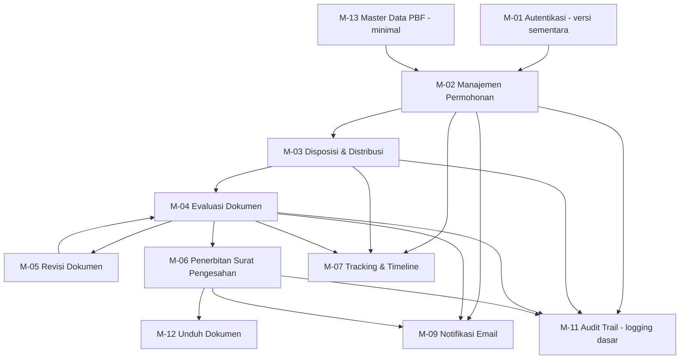

# TAHAP 6 — DEVELOPMENT PLAN (REVISI)
## Aplikasi Pengajuan Rancangan Denah Pedagang Besar Farmasi (PBF)

**Dokumen:** Development Roadmap — MVP 3 Minggu + Backlog Phase 2
**Versi:** 2.0 (Revisi berdasarkan constraint tim & waktu)
**Acuan:** Tahap 3–5 (disetujui). Menggantikan roadmap v1.0 (21 minggu) karena constraint baru: **tim 2 orang, tanpa QA, target 3 minggu, integrasi SSO/WA berjalan paralel**.

---

## 0. Realitas Constraint — Mohon Dibaca Dulu

17 modul penuh + 2 portal + integrasi eksternal (SSO BPOM, WhatsApp Gateway) **tidak bisa selesai production-ready dalam 3 minggu** dengan 2 orang tanpa QA — berapa pun jam lembur dikerjakan, karena beberapa dependency (akses SSO, kontrak WA Gateway) berada **di luar kendali tim development**.

Supaya target 3 minggu tetap realistis dan hasilnya **bisa benar-benar dipakai** (bukan separuh jadi di semua sisi), roadmap ini dipecah jadi dua:

- **Phase 1 (3 minggu ke depan)** — MVP alur inti bisnis, end-to-end, dengan **login internal sementara** (bukan SSO asli) dan **notifikasi Email saja** (WA menyusul). Ini yang dikerjakan sekarang.
- **Phase 2 (setelah Phase 1 live)** — modul pelengkap (dashboard SLA visual, laporan, reassignment, manajemen user via UI, audit trail viewer, konfigurasi sistem via UI) + **swap ke SSO & WA Gateway asli** begitu akses/kontraknya selesai diproses secara paralel.

> **Asumsi kerja yang saya pakai** (tolong dikoreksi jika salah): selama SSO BPOM belum bisa diakses, role internal login pakai **email + password biasa** (akun dibuat manual oleh Anda/Admin IT lewat seeder, bukan UI dulu). Ini murni pengganti sementara — pada Tahap 4, autentikasi sudah dirancang lewat 1 tabel `users` yang tidak terikat mekanisme login tertentu, jadi swap ke SSO nanti **tidak mengubah struktur data**, hanya mengganti driver login.

---

## 1. Strategi untuk Tim 2 Orang Tanpa QA

1. **Bagi berdasarkan layer, bukan berdasarkan modul** — Dev A fokus backend/business logic (migration, model, service class, status engine), Dev B fokus Blade/UI + integrasi (form, tabel, notifikasi trigger). Ini mengurangi tabrakan kerja di file yang sama dibanding dibagi per-modul.
2. **Tidak ada QA terpisah → testing dilakukan bersama di akhir tiap minggu.** Setiap Jumat, kedua developer berhenti coding fitur baru dan menjalankan **checklist manual alur end-to-end** (daftar di bagian 4) sebelum lanjut minggu berikutnya. Ini menggantikan peran QA secara minimal — bukan pengganti sempurna, tapi mencegah bug menumpuk sampai akhir.
3. **Code review silang wajib** sebelum merge ke branch utama, walau tim kecil — 2 pasang mata tetap lebih baik dari 1 untuk mengurangi bug lolos tanpa QA.
4. **Scope Phase 1 bersifat tegas/tertutup** — modul yang tidak ada di daftar Phase 1 (bagian 2) **tidak dikerjakan** dalam 3 minggu ini apa pun alasannya. Kalau ada permintaan tambahan di tengah jalan, dicatat sebagai backlog Phase 2, bukan disisipkan (scope creep adalah risiko terbesar untuk timeline seketat ini).
5. **Audit trail tetap dicatat sejak awal** (insert log dasar di setiap aksi penting), walau **UI untuk melihat/filter log** baru dibuat di Phase 2 — supaya begitu Phase 1 live, data historis untuk keperluan audit sudah lengkap sejak hari pertama.

---

## 2. Scope Phase 1 (MVP — 3 Minggu) vs Phase 2 (Backlog)

| Modul | Phase 1 (3 minggu) | Phase 2 (setelah live) |
|---|---|---|
| M-01 Autentikasi & Akses | ✅ Versi sementara: login email+password manual (internal), login Pemohon email/WA+password+OTP dummy | Swap ke SSO BPOM asli (paralel, lihat bagian 5) |
| M-13 Master Data PBF | ✅ Minimal — tersimpan otomatis saat input permohonan, tanpa UI CRUD terpisah | UI kelola Master Data PBF penuh (Admin IT) |
| M-02 Manajemen Permohonan | ✅ Input permohonan, generate no. registrasi, upload 5 dokumen | Pengajuan ulang mandiri via portal pemohon *(jika waktu tidak cukup di Phase 1, masuk Phase 2 — lihat catatan bawah)* |
| M-03 Disposisi & Distribusi | ✅ Penuh | Reassignment dipisah ke M-17 (Phase 2) |
| M-04 Evaluasi Dokumen | ✅ Penuh, termasuk PDF viewer tertanam sederhana | — |
| M-05 Revisi Dokumen | ✅ Penuh (siklus maks. 3x + status Ditutup–Perlu Pengajuan Ulang) | — |
| M-06 Penerbitan Surat Pengesahan | ✅ Penuh | — |
| M-07 Tracking Status & Timeline | ✅ Horizontal stepper dengan waktu pengerjaan (versi fungsional, styling minimal) | Polish visual/animasi |
| M-12 Unduh Dokumen | ✅ Penuh | — |
| M-09 Notifikasi Otomatis | ⚠️ **Email saja**, trigger di setiap perubahan status | WhatsApp Gateway asli (paralel, lihat bagian 5) |
| M-11 Audit Trail | ⚠️ Logging dasar saja (insert ke tabel, tanpa UI) | Halaman viewer + filter Audit Trail |
| M-08 Dashboard Monitoring SLA | ⚠️ Versi minimal: kolom "terlambat/tidak" di tabel daftar permohonan | Dashboard visual lengkap (kartu ringkasan, warna kuning/merah, Tahap 5 §8) |
| M-10 Manajemen User & Role | ⚠️ Dikelola lewat Artisan seeder/tinker oleh developer, bukan UI | UI CRUD User & Role untuk Admin IT |
| M-16 Konfigurasi Sistem | ⚠️ SLA & kalender libur hardcode di file config/seed | UI Konfigurasi Sistem untuk Admin IT |
| M-15 Monitoring View-Only (Kepala Balai) | ⚠️ Kepala Balai pakai daftar permohonan biasa (sama seperti role lain, belum versi khusus) | Dashboard view-only sesuai Tahap 5 §2.1 |
| M-17 Eskalasi & Reassignment | ❌ Tidak ada di Phase 1 (jika darurat, reassign manual lewat database oleh developer) | Fitur reassign & reminder via UI |
| M-14 Laporan & Ekspor Data | ❌ Tidak ada di Phase 1 | Rekap & export Excel/PDF |

> **Catatan penting soal M-02 (pengajuan ulang mandiri):** jika di akhir minggu ke-2 progres berjalan sesuai rencana, fitur ini tetap diusahakan masuk Phase 1. Jika waktu mepet, ini adalah **kandidat pertama yang dipotong** ke Phase 2 — karena secara bisnis kasus ini baru muncul setelah ada permohonan yang gagal revisi ke-3, jadi tidak akan langsung dibutuhkan di hari-hari pertama go-live.

---

## 3. Dependency Antar Modul (Tidak Berubah dari v1.0)

*Modul Phase 2 (M-08 penuh, M-10 UI, M-14, M-15 penuh, M-16 UI, M-17) sengaja tidak digambar di sini karena tidak dikerjakan dalam 3 minggu ini.*

---

## 4. Rencana Kerja Mingguan (3 Minggu, 2 Developer)

### Minggu 1 — Fondasi + Input Permohonan
| Hari | Dev A (Backend/Logic) | Dev B (Blade/UI + Integrasi) |
|---|---|---|
| 1–2 | Setup Laravel 13, migration tabel Phase 1 (lihat catatan di bawah), seed `roles`, `status_master`, `sla_config`, `kalender_libur` | Setup Tailwind, base layout Blade, skeleton navigasi 4 role + portal pemohon |
| 3 | Auth internal (email+password + middleware role) | Auth Pemohon (email/WA+password) + halaman OTP dummy |
| 4–5 | Backend M-13 (simpan otomatis) + M-02 (generate no. registrasi, simpan dokumen) | Form Input Permohonan (Kepala Balai) + komponen upload dropzone + Dashboard shell tiap role (list kosong) |
| **Cek akhir minggu** | ☑ Bisa login semua role & pemohon dummy ☑ Bisa input 1 permohonan lengkap sampai tersimpan di database |

**Migration Phase 1 saja** (tabel di luar ini ditunda ke Phase 2): `roles`, `users`, `master_data_pbf`, `pemohons`, `status_master`, `permohonans`, `dokumen_permohonan`, `evaluasi`, `disposisi`, `distribusi`, `status_history`, `notifikasi_log`, `audit_trail`, `sla_config`, `kalender_libur`, `password_reset_otp`. Tabel `template_notifikasi`, `reassignment_log`, `reminder_log` dibuat di Phase 2.

### Minggu 2 — Disposisi, Distribusi, Evaluasi
| Hari | Dev A | Dev B |
|---|---|---|
| 6–7 | Backend M-03 (disposisi & distribusi) + logika `status_history` (hitung hari kerja pakai `kalender_libur`) | UI Disposisi (Kepala Balai) + UI Distribusi (Ketua Tim) |
| 8–9 | Backend M-04 (form evaluasi, kontrol hasil Lengkap/Tidak Lengkap, batas revisi) | UI Form Evaluasi (Staff) + PDF viewer tertanam sederhana (embed, tombol unduh disembunyikan di UI) |
| 10 | Perbaikan bug dari testing bersama | Dashboard Ketua Tim & Staff (list permohonan sesuai perannya) |
| **Cek akhir minggu (Jumat)** | ☑ **Testing bersama end-to-end:** Input → Disposisi → Distribusi → Evaluasi (coba skenario Lengkap & Tidak Lengkap) |

### Minggu 3 — Revisi, Penerbitan, Tracking, Notifikasi, Go-Live
| Hari | Dev A | Dev B |
|---|---|---|
| 11 | Backend M-05 (upload revisi pemohon, loop ke evaluasi ulang, transisi Ditutup–Perlu Pengajuan Ulang) | UI Upload Revisi (Pemohon) + tampilkan catatan/narasi evaluasi |
| 12 | Backend M-06 (upload surat final, status Terbit) + M-12 (unduh) | UI Upload Surat Pengesahan (Staff) + tombol Unduh (Pemohon) |
| 13 | Notifikasi Email (Laravel Mail) trigger di semua perubahan status penting + Audit Trail logging dasar | Halaman Tracking Status — horizontal stepper (Tahap 5 §4) pakai data `status_history` asli |
| 14 | **Testing bersama end-to-end penuh** (termasuk siklus revisi 1–3x & pengajuan ulang jika sempat masuk scope) + perbaikan bug kritis | Idem, fokus cek tampilan & alur pemohon |
| 15 | Deploy ke server produksi/staging, buat 4 akun awal (role internal) + dokumentasi singkat cara pakai | Idem — pendampingan deploy, smoke test terakhir |

---

## 5. Yang Berjalan Paralel (Sesuai Arahan Anda)

Ini **tidak menyita waktu 2 developer** di atas — dikerjakan Anda/pihak terkait di luar jalur coding:

| Item | Proses Paralel | Kapan "Disambungkan" ke Sistem |
|---|---|---|
| **SSO BPOM** | Ajukan akses/dokumentasi API ke tim SSO BPOM mulai sekarang | Begitu akses didapat, developer swap driver login internal (email+password) → SSO — perubahan terisolasi di modul M-01, tidak menyentuh modul lain (Tahap 4 §4.2, tabel `users` sudah punya kolom `sso_uid`) |
| **WhatsApp Gateway** | Proses procurement/kontrak provider WA Gateway mulai sekarang | Begitu kontrak & kredensial API siap, developer tambahkan channel WA di M-09 — Email tetap jalan sebagai fallback (NFR-06), tidak mengganggu notifikasi yang sudah berjalan |

> Karena 2 hal ini prosesnya di luar kendali tim development (menunggu instansi lain), **jangan dijadikan blocker** untuk go-live Phase 1 — itu sebabnya Phase 1 didesain bisa jalan penuh tanpa keduanya.

---

## 6. Risiko Spesifik untuk Setup Ini

| Risiko | Dampak | Mitigasi |
|---|---|---|
| Tanpa QA formal, bug berpotensi lolos ke pengguna | Kepercayaan pengguna awal turun jika sering error | Checklist testing manual wajib tiap akhir minggu (bagian 4) + code review silang; **prioritaskan stabilitas alur inti** di atas kelengkapan fitur |
| Login internal sementara (bukan SSO) berarti password dikelola manual | Risiko keamanan lebih tinggi dibanding SSO terpusat, dan beban Admin IT manual buat akun | Password di-hash standar Laravel (bcrypt), jumlah user internal awal biasanya kecil (4 role) sehingga pembuatan manual masih wajar untuk fase awal |
| 3 minggu sangat ketat untuk 2 orang — 1 orang sakit/cuti bisa menggeser signifikan | Timeline meleset | Tidak ada buffer di rencana ini — jika ada gangguan, modul pertama yang dikorbankan adalah M-02 pengajuan ulang mandiri & polish UI (bukan alur inti) |
| Scope Phase 1 "merayap" karena permintaan tambahan di tengah jalan | Timeline 3 minggu gagal tercapai | Aturan tegas di Strategi #4 — semua permintaan baru dicatat sebagai backlog Phase 2, tidak dikerjakan sekarang |

---

## 7. Setelah Phase 1 Live — Gambaran Phase 2

Setelah MVP berjalan, Phase 2 mencakup: M-08 (dashboard SLA visual penuh), M-10 (UI manajemen user & role), M-11 (viewer audit trail), M-14 (laporan & ekspor), M-15 (dashboard view-only Kepala Balai versi penuh), M-16 (UI konfigurasi sistem), M-17 (eskalasi & reassignment), plus swap SSO & WA Gateway asli begitu akses/kontrak selesai. Estimasi kasar Phase 2 dengan tim yang sama: **± 6–8 minggu**, tapi ini sebaiknya direncanakan ulang detail (roadmap tersendiri) setelah Phase 1 live dan Anda bisa lihat modul mana yang paling mendesak dari kebutuhan pengguna nyata.

---

**Status Dokumen:** Final untuk Tahap 6 v2.0 — siap dijadikan acuan kerja 3 minggu ke depan. Satu hal yang perlu dikonfirmasi: apakah asumsi **login internal sementara (email+password manual, bukan SSO)** di bagian 0 sudah sesuai, atau ada kendala kebijakan instansi yang mengharuskan SSO sejak hari pertama?
